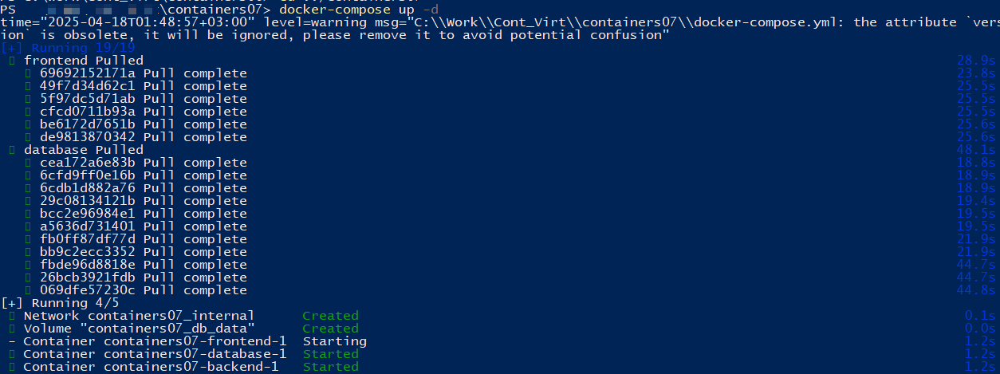
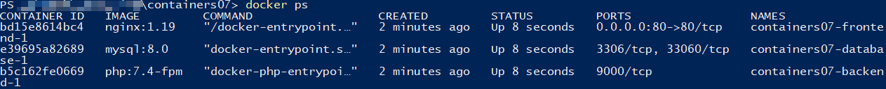
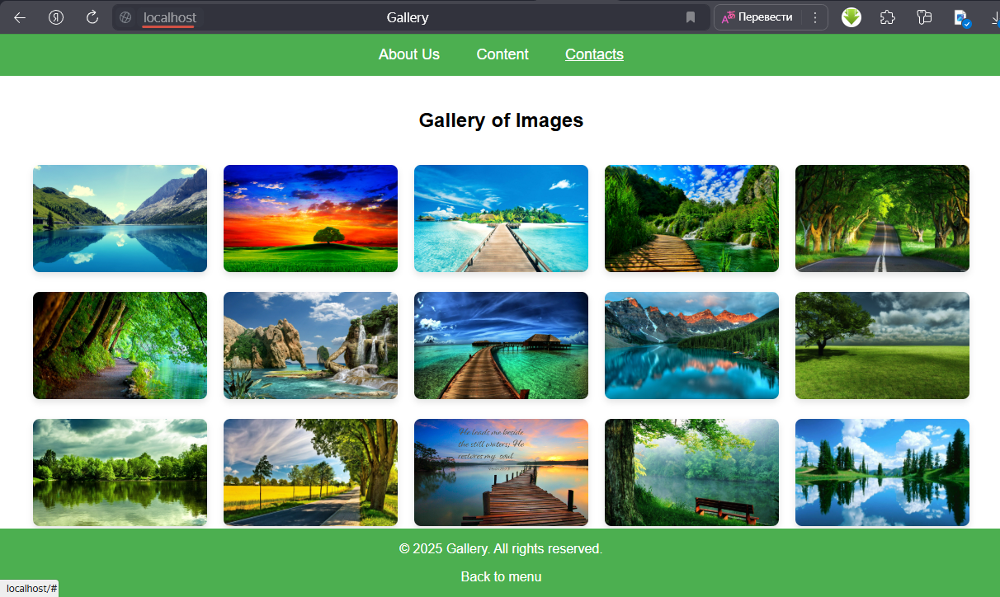

# Лабораторная работа №6: Создание многоконтейнерного приложения

## Цель работы  

Ознакомиться с работой многоконтейнерного приложения на базе docker-compose.

## Задание  

Создать PHP-приложение на базе трёх контейнеров: nginx, php-fpm, mariadb, используя docker-compose.

## Выполнение  

- В директории `containers07` был создан конфигурационный файл `nginx/default.conf` и размещён проект PHP, аналогично прошлой лабораторной работе, в которой данный процесс описан подробно.  
- В директории `containers07` был создан файл `docker-compose.yml` со следующим содержимым:

```yaml
version: '3.9'

services:
  frontend:
    image: nginx:1.19
    volumes:
      - ./mounts/site:/var/www/html
      - ./nginx/default.conf:/etc/nginx/conf.d/default.conf
    ports:
      - "80:80"
    networks:
      - internal

  backend:
    image: php:7.4-fpm
    volumes:
      - ./mounts/site:/var/www/html
    networks:
      - internal
    env_file:
      - mysql.env

  database:
    image: mysql:8.0
    env_file:
      - mysql.env
    networks:
      - internal
    volumes:
      - db_data:/var/lib/mysql

networks:
  internal: {}

volumes:
  db_data: {}
```

- Для переменных окружения создан файл `mysql.env` с содержимым:

```env
MYSQL_ROOT_PASSWORD=secret
MYSQL_DATABASE=app
MYSQL_USER=user
MYSQL_PASSWORD=secret
```

- Запустил `docker-compose` командой `docker-compose up -d`

- Проверил успешно ли работают контейнеры

- Проверил результат, открыв в браузере `http://localhost`


### Ответы на вопросы

- В каком порядке запускаются контейнеры?
Контейнеры запускаются в следующем порядке:
   1. `database` (сначала база данных, чтобы другие сервисы могли к ней подключаться);
   2. `frontend` (nginx);
   3. `backend` (php-fpm).

- Где хранятся данные базы данных?
Данные бд хранятся в томе, который указан как `volume` в `docker-compose`, в моем случае в `db_data`. Это том монтируется в контейнер `database`

- Как называются контейнеры проекта?
   1. frontend (nginx)
   2. backend (php-fpm)
   3. database (mariadb)

- Вам необходимо добавить еще один файл app.env с переменной окружения `APP_VERSION` для сервисов `backend` и `frontend`. Как это сделать?
Чтобы добавить переменную окружения для сервисов, нужно создать файл `app.env` с переменной `APP_VERSION`, затем добавить его в секцию `env_file` для сервисов `backend` и `frontend` в `docker-compose.yml`

## Выводы

В ходе данной лабораторной работы мною были закреплены на практике теоретические знания о запуске многоконтейнерного приложения с помощью `docker-compose`.
Данный командный файл помогает удобно описывать сервисы, которые должны быть запущены и их параметры.

Хоть в данной работе база данных не фигурировала в процессе взаимодействия контейнеров в явном виде, исходя из скриншотов можно видеть, что данный сервис также был успешно запущен, и веб-страница стала доступна по адресу `localhost`.

## Библиография

`https://moodle.usm.md/mod/assign/view.php?id=285458`
